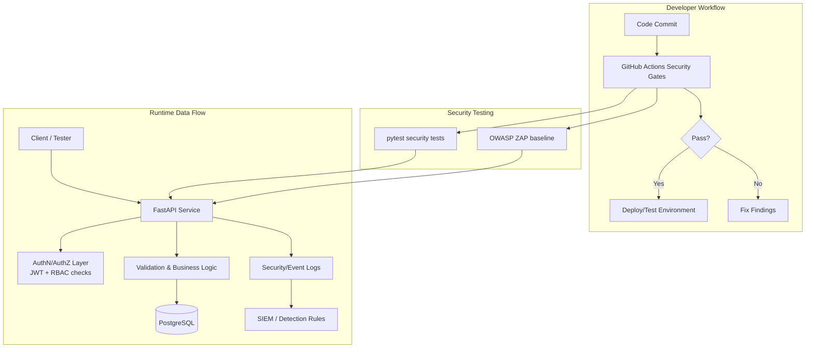

# API Security Testing & Hardening Lab

A practical cybersecurity engineering project that simulates common API security weaknesses and then hardens them with measurable controls.

## Why this project
- Demonstrates secure SDLC thinking from design to detection
- Uses realistic tooling (Python, tests, scanners, CI gates)
- Produces artifacts that can be discussed in interviews

## Tech Stack
- **Python 3.11+**, FastAPI, SQLAlchemy
- **PostgreSQL**
- **Docker Compose**
- **pytest** (security-focused tests)
- **OWASP ZAP baseline scan**
- **GitHub Actions**: Bandit, Semgrep, Trivy, Gitleaks

## Architecture (Lab + Security Controls)


## Project Layout
```text
api-security-lab/
├── app/
│   ├── __init__.py
│   └── main.py
├── tests/
│   └── test_security_basics.py
├── threat-model/
│   ├── threat-model-notes.md
│   └── stride-threat-model.md
├── detections/
│   └── sigma/
│       └── api-abuse-rules.yml
├── docs/
│   ├── hardening-checklist.md
│   ├── soc-triage-api-abuse.md
│   ├── cloud-evidence-azure.md
│   └── interview-talking-points.md
├── scripts/
│   └── run_zap_baseline.sh
├── .github/workflows/
│   └── security-gates.yml
├── SECURITY.md
├── RISK_REGISTER.md
├── INCIDENT_RUNBOOK.md
├── docker-compose.yml
├── requirements.txt
└── README.md
```

## Quick Start Demo (10–15 min)

### 1) Setup environment
```bash
cd api-security-lab
python3 -m venv .venv
source .venv/bin/activate
pip install -r requirements.txt
```

### 2) Start the API
```bash
uvicorn app.main:app --reload --port 8000
```

### 3) Validate baseline health
```bash
curl -i http://127.0.0.1:8000/health
```

### 4) Run security-focused unit/integration checks
```bash
pytest -q
```

### 5) Run ZAP baseline scan
```bash
bash scripts/run_zap_baseline.sh
```

### 6) Run local static checks (optional but recommended)
```bash
# install tools once
pip install bandit semgrep

# code checks
bandit -r app -q
semgrep --config p/owasp-top-ten app --error
```

## Security Artifacts Included
- STRIDE threat model: `threat-model/stride-threat-model.md`
- Detection engineering samples: `detections/sigma/api-abuse-rules.yml`
- SOC triage notes: `docs/soc-triage-api-abuse.md`
- Azure hardening evidence notes: `docs/cloud-evidence-azure.md`
- Security docs: `SECURITY.md`, `RISK_REGISTER.md`, `INCIDENT_RUNBOOK.md`
- Interview prep: `docs/interview-talking-points.md`

## Current Status
- ✅ Scaffolded API + tests
- ✅ Threat modeling expanded (STRIDE)
- ✅ Detection and SOC triage content added
- ✅ CI security gates added
- ⏳ Next: implement additional vulnerable/hardened endpoint pairs and map each to explicit tests

## Interview Value (short version)
- “I treated this as a mini secure SDLC project: design, build, detect, and respond.”
- “I added CI security gates that fail on meaningful findings, not just informational noise.”
- “I can explain API abuse scenarios from attacker behavior through SOC response steps.”
