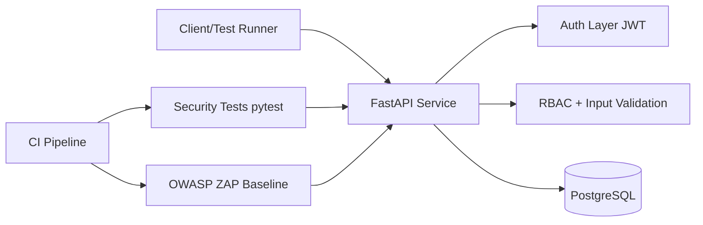

# Project 1: API Security Testing & Hardening Lab

A practical cybersecurity engineering project: build a small API that includes common security flaws, then harden it with measurable improvements.

## Objectives
- Demonstrate API threat modeling and secure design
- Implement vulnerable and hardened API behavior
- Automate security checks in CI
- Produce artifacts useful in interviews (test output + findings)

## Tech Stack
- **Python 3.11+**, FastAPI, SQLAlchemy
- **PostgreSQL**
- **Docker Compose**
- **OWASP ZAP baseline scan**
- **pytest** for security-focused tests

## Architecture


## Project Layout
```text
project-01-api-security-lab/
├── app/
│   ├── __init__.py
│   └── main.py
├── tests/
│   └── test_security_basics.py
├── threat-model/
│   └── threat-model-notes.md
├── scripts/
│   └── run_zap_baseline.sh
├── docs/
│   └── hardening-checklist.md
├── docker-compose.yml
├── requirements.txt
└── README.md
```

## Threat Model Notes (Summary)
Detailed notes: [`threat-model/threat-model-notes.md`](./threat-model/threat-model-notes.md)

Top risks covered in this phase:
1. Broken authentication / weak token handling
2. Broken object-level authorization (BOLA)
3. Injection through unsanitized input
4. Missing rate limiting enabling brute force
5. Sensitive data exposure in responses/logs

## Setup
### 1) Create virtual environment
```bash
cd project-01-api-security-lab
python3 -m venv .venv
source .venv/bin/activate
pip install -r requirements.txt
```

### 2) Run locally
```bash
uvicorn app.main:app --reload --port 8000
```

### 3) Run tests
```bash
pytest -q
```

### 4) Run with Docker Compose (API + Postgres)
```bash
docker compose up --build
```

### 5) Run ZAP baseline scan
```bash
bash scripts/run_zap_baseline.sh
```

## Current Status (Scaffold)
- ✅ Initial structure created
- ✅ Starter API endpoint added
- ✅ Security test skeleton added
- ✅ Threat model starter notes added
- ⏳ Next: implement auth, RBAC, vulnerable endpoints, hardening toggles, CI pipeline

## Interview Talking Points
- “I built this as an engineering-focused API security lab, not a CTF.”
- “I used automated checks (pytest + ZAP) so security quality is repeatable.”
- “I documented threats and mapped them to code-level mitigations.”
